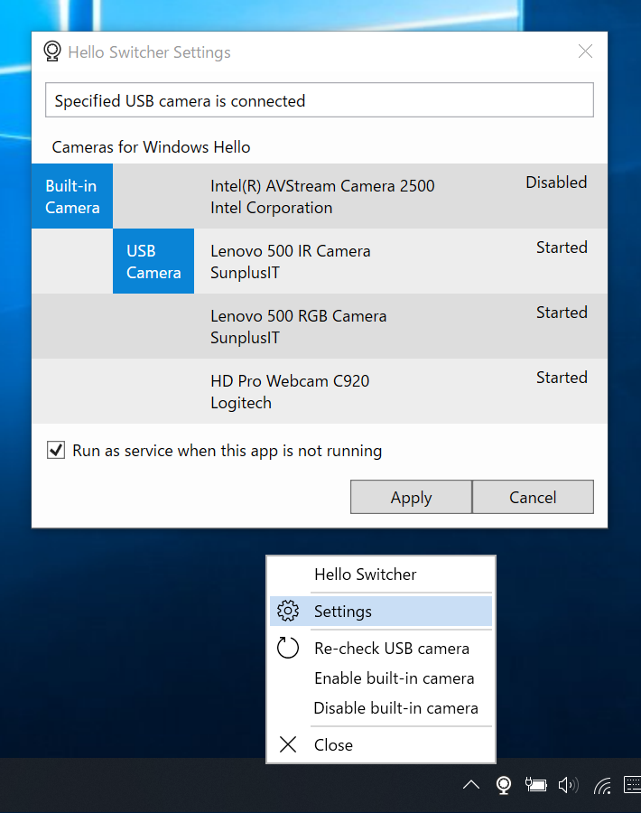

# Hello Switcher

Hello Switcher is a Windows desktop tool to help switching Windows Hello cameras.

 
(DPI: 150%)

If your PC has a built-in Windows Hello camera like a Surface series and you wish to add a USB web camera which has Windows Hello capability* for using Windows Hello authentication even when the built-in camera cannot be used, you will not be able to switch the two cameras as you might expect. It is because Microsoft has not added the functionality to manage multiple Windows Hello cameras to Windows 10 yet.

This tool helps switching between a built-in camera and a USB camera. It works as follows:

- If a specifiled USB camera is connected to your PC, this tool will __disable__ a specified built-in camera so that the USB camera is used for Windows Hello.
- If the USB camera is disconnected, this tool will __enable__ the built-in camera so that it will be used for Windows Hello again.

This tool internally calls [PnPUtil](https://docs.microsoft.com/en-us/windows-hardware/drivers/devtest/pnputil), a command-line tool which is included in the OS for managing devices, with administrator privilege to enable/disable a built-in camera.

(* USB cameras with Windows Hello capability are limited in the market: Mouse Computer CM02, Logitech Brio Webcam, Lenovo 500 FHD Webcam and so on.)

## Requirements

 * Windows 10
 * .NET Framework 4.8

## Download

:floppy_disk: [Executable](https://github.com/emoacht/HelloSwitcher/releases/download/1.1.0/HelloSwitcher110.zip)

## Getting started

1. Run the executable file. This tool's icon will appear in the notification area. Open the menu by right click and select `Open settings`. Then the settings window will appear.

2. Specify a built-in camera used for Windows Hello and a USB camera which you wish to use for Windows Hello and then click `Apply`. That's all.

3. If you wish to run this tool from startup, register it in Task Scheduler.

    - In `Gereral`, check `Run with highest privileges`.
    - In `Conditions`, uncheck __both__ `Start the task only if the computer is on AC power` and `Stop if the computer switches to battery power`.
    - In `Settings`, uncheck `Stop the task if it runs longer than:`.

## Remarks

Since this tool runs after the OS's sign-in, it cannot change at sign-in, enabled/disabled state of the specified built-in camera at last sign-out.

## History

Ver 1.1 2021-2-18

 - Change to use PnPUtil instead of DevCon
 - Add settings window

Ver 1.0 2020-6-9

 - Initial release

## License

 - MIT License

## Libraries

 - [XamlBehaviors for WPF](https://github.com/microsoft/XamlBehaviorsWpf)

## Developer

 - emoacht (emotom[atmark]pobox.com)
